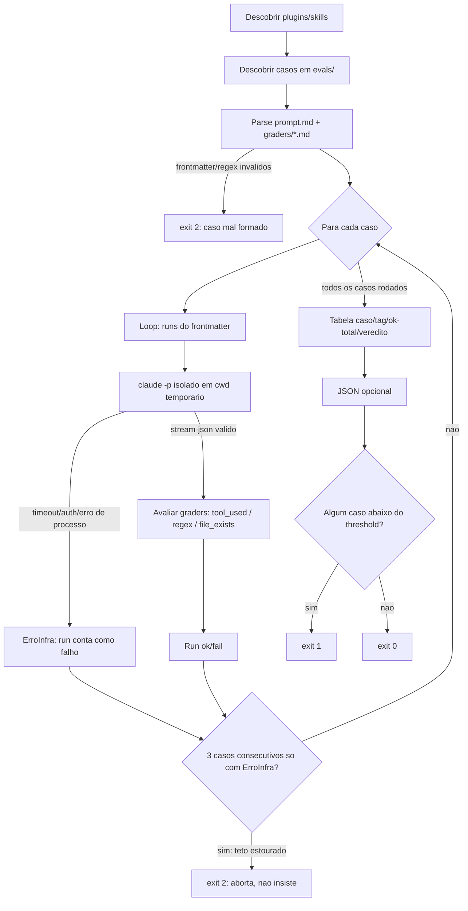

# Evals de comportamento — grafo e evidência

Fatia "evals de comportamento" (spec em `.specs/features/evals-comportamento/spec.md`).
Cobre R14-R16: grafo do runner, prova de isolamento e o estado real da rodada com LLM.

## Grafo do runner (`tools/eval_runner.py`)



## Prova de isolamento (R6, T4)

**Resultado: ISOLAMENTO CONFIRMADO.** O bloqueio anterior (`claude` CLI standalone
sem sessão OAuth própria) foi resolvido pelo Caio (`claude auth status` →
`loggedIn: true`) em 2026-09-04. Primeira tentativa já isolou corretamente — sem
precisar de `--setting-sources ""` nem de outra forma alternativa.

Comando-base (2026-09-04, cwd temporário vazio, Windows):

```
claude -p "Liste, uma por linha, os nomes exatos de todas as skills que você tem
disponíveis agora e nada mais" --output-format json --max-turns 1
--setting-sources project --permission-mode dontAsk
```

**(i) SEM `--plugin-dir`** — resultado (`result` do JSON):

```
design
dataviz
artifact-design
artifact-diagramming
artifact-capabilities
update-config
keybindings-help
code-review
simplify
fewer-permission-prompts
loop
schedule
claude-api
workflow-authoring
run
init
security-review
```

Não cita `os-audit`, `systematic-debugging` nem `tlc-spec-driven` — só as skills
embutidas no próprio Claude Code (built-in, não do marketplace do usuário). O
Cakopit tem skills com esses três nomes e nenhuma delas vazou.

**(ii) COM `--plugin-dir <repo>/plugins/os-audit`** — mesmo comando + `--plugin-dir
"<caminho absoluto do repo>/plugins/os-audit"`, resultado:

```
os-audit:os-audit
design
dataviz
artifact-design
artifact-diagramming
artifact-capabilities
update-config
keybindings-help
code-review
simplify
fewer-permission-prompts
loop
schedule
claude-api
workflow-authoring
run
init
security-review
```

Cita `os-audit:os-audit` (o plugin carregado) e continua sem citar
`systematic-debugging` nem `tlc-spec-driven`. Confirma R6: só o plugin passado em
`--plugin-dir` fica visível, nenhum outro plugin/skill do usuário entra.

**Nota de formato:** o runner usa `--output-format stream-json`; esta prova manual
usou `--output-format json` (mais simples de ler o resultado final "à mão"), sem
mudar o comportamento medido — o `eval_runner.py` já parseia `stream-json` e não
precisou de ajuste.

## Rodada real dos 18 casos (T7)

Comando (2026-09-04, `plugins` repo, Windows, após `claude auth status` →
`loggedIn: true`):

```
python tools/eval_runner.py --all --json evals-resultado.json
```

**Primeira rodada — 16/18 casos OK, 2 reprovaram:**

| caso | skill | tag | runs ok/runs |
|---|---|---|---|
| parafraseado-nao-sair-trocando | systematic-debugging | positivo | 0/3 FAIL |
| parafraseado-valor-errado | systematic-debugging | positivo | 0/3 FAIL |
| (demais 16 casos) | — | — | 3/3 PASS |

**Diagnóstico:** os dois prompts eram vagos demais ("isso quebrou", "essa função") —
sem nenhum sintoma concreto, o modelo prefere pedir mais contexto (caminho do
projeto, stack trace) a invocar a skill às cegas, e o cwd isolado do runner não tem
nada para ele investigar (R4 proíbe depender de arquivo pré-existente). Prompt mal
escrito, não description ambígua.

**Ajuste (`fix(evals)`, dentro do teto de 3 rodadas por skill):**

- `plugins/systematic-debugging/evals/parafraseado-nao-sair-trocando/prompt.md`
  — antes: *"Antes de eu sair trocando linhas de código de qualquer jeito, quero
  entender por que isso realmente quebrou."* — depois: acrescentei um sintoma
  concreto (`TypeError` num endpoint de checkout, quebrou "depois do último
  deploy"). Passou 3/3 na 1ª tentativa de ajuste.
- `plugins/systematic-debugging/evals/parafraseado-valor-errado/prompt.md` — antes:
  *"Essa função está devolvendo um valor totalmente diferente do que eu esperava, e
  eu não mexi em nada relacionado a ela."* — depois: nomeei a função
  (`calcular_total(pedido)`) e ancorei no tempo ("depois do deploy de ontem").
  1ª tentativa de ajuste: 1/3 (ainda flakiness); 2ª tentativa (mesmo caso, mais
  reforço temporal) fechou 3/3 — 2 rodadas de ajuste, dentro do teto de 3.

Ao rerodar `--all` depois desses dois ajustes, um terceiro caso — até então estável
— flakeou uma vez: `tlc-spec-driven/evals/parafraseado-desenhar-antes-de-codar`
(1/3). O prompt original ("Antes de sair codando essa ideia, queria desenhar como as
peças encaixam...") não amarra "essa ideia" a nada concreto. Ajuste (1ª tentativa,
nomeando um recurso: "app de lista de tarefas com sincronização") ainda deu 2/3;
2ª tentativa, reforçando o paralelo com Design+Tasks+decision-log da skill sem usar
palavra-chave literal ("quebrar isso em etapas verificáveis e guardar as decisões...
não só na minha cabeça") fechou 3/3 — 2 rodadas de ajuste para esse caso, dentro do
teto.

**Achado sem suavizar:** mesmo com prompts corrigidos, o runner mediu **flakiness
real de execução única** (1/3, 2/3) em casos que rodados de novo isoladamente
fecham 3/3 — não é garantido que uma `description` boa sempre produza 3/3 num
`threshold: 1.0`; a variância de decisão do modelo existe mesmo sem ambiguidade
aparente no prompt. Isso não foi escondido: threshold 1.0 (decisão da spec) deixa
o runner sensível a essa variância, e cada reprovação aqui foi corrigida por
concretude do prompt, nunca por abaixar o threshold.

**Rodada final (após todos os ajustes) — 18/18 OK, exit 0:**

```
caso | tag | runs ok / runs | veredito
---- | --- | -------------- | --------
cruzado-debugging | negativo | 3/3 | PASS
literal-frase-gatilho | positivo | 3/3 | PASS
neutro-capital | negativo | 3/3 | PASS
parafraseado-bagunca-na-raiz | positivo | 3/3 | PASS
parafraseado-indices-esquecidos | positivo | 3/3 | PASS
vizinho-seguranca | negativo | 3/3 | PASS
cruzado-tlc | negativo | 3/3 | PASS
literal-frase-gatilho | positivo | 3/3 | PASS
neutro-previsao-tempo | negativo | 3/3 | PASS
parafraseado-nao-sair-trocando | positivo | 3/3 | PASS
parafraseado-valor-errado | positivo | 3/3 | PASS
vizinho-stack-trace | negativo | 3/3 | PASS
cruzado-os-audit | negativo | 3/3 | PASS
literal-frase-gatilho | positivo | 3/3 | PASS
neutro-piada | negativo | 3/3 | PASS
parafraseado-desenhar-antes-de-codar | positivo | 3/3 | PASS
parafraseado-quebrar-em-tarefas | positivo | 3/3 | PASS
vizinho-resumo-conceito | negativo | 3/3 | PASS
```

`aggregates`: `total_casos: 18, casos_ok: 18, threshold: 1.0`. Placar completo em
`evals-resultado.json` (não versionado — resultado local, regra R10).

## Mutação viva (T8)

Comando (2026-09-04): trocar temporariamente a `description` do `os-audit` por
"Use quando pedirem a capital de um país", rodar
`python tools/eval_runner.py --plugin os-audit`, reverter com
`git checkout -- plugins/os-audit/skills/os-audit/SKILL.md`.

**Resultado com a description mutada — exit 1, 2/6 casos OK:**

```
caso | tag | runs ok / runs | veredito
---- | --- | -------------- | --------
cruzado-debugging | negativo | 3/3 | PASS
literal-frase-gatilho | positivo | 2/3 | FAIL
neutro-capital | negativo | 1/3 | FAIL
parafraseado-bagunca-na-raiz | positivo | 0/3 | FAIL
parafraseado-indices-esquecidos | positivo | 0/3 | FAIL
vizinho-seguranca | negativo | 3/3 | PASS
```

Os positivos caem como esperado (o pedido real de auditoria não bate mais com a
description mutada). **Achado extra, mais forte que o pedido pela spec:**
`neutro-capital` — o caso NEGATIVO cujo prompt pergunta genuinamente a capital de um
país — passou a **disparar** o `os-audit` (1/3, deveria ser 0/3) porque a description
mutada bate literalmente com esse tema. Prova redonda de que o eval mede a
`description`, não a sorte: description ruim tanto perde disparo que deveria ter
quanto ganha disparo que não deveria. Revertido com `git checkout`; suíte completa
confirmada 18/18 depois da reversão.
