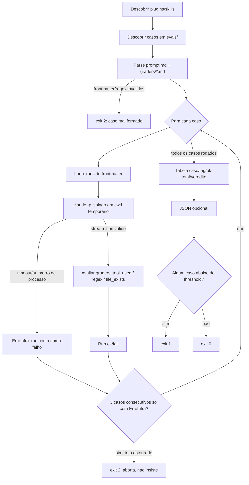

# Evals de comportamento — grafo e evidência

Fatia "evals de comportamento" (spec em `.specs/features/evals-comportamento/spec.md`).
Cobre R14-R16: grafo do runner, prova de isolamento e o estado real da rodada com LLM.

## Grafo do runner (`tools/eval_runner.py`)



## Prova de isolamento (R6, T4)

**Resultado: BLOQUEADA por um problema de ambiente, não de isolamento.** Registrado
aqui em vez de simulado — evidência-ou-zero.

Comando-base (2026-09-03, `plugins` repo, Windows):

```
claude -p "Liste, uma por linha, os nomes exatos de todas as skills que você tem
disponíveis agora e nada mais" --output-format stream-json --verbose --max-turns 1
--setting-sources project --permission-mode dontAsk
```

Três tentativas, todas com o mesmo resultado (`"text":"Not logged in · Please run
/login"`, `"error":"authentication_failed"`, `"apiKeySource":"none"`):

1. Cwd temporário vazio, sem `--plugin-dir`, `--setting-sources project`.
2. Igual a 1, mais `CLAUDE_CONFIG_DIR` apontando para uma pasta temporária contendo
   só uma cópia de `~/.claude/.credentials.json`.
3. Cwd do próprio repo (`plugins/`), sem nenhuma restrição de `--setting-sources`
   (todas as fontes) — nem esse caso, que não testa isolamento nenhum, autentica.

**Diagnóstico:** o `claude` CLI standalone, quando invocado como subprocesso a partir
desta sessão, não reaproveita a sessão OAuth do app que hospeda o agente —
`~/.claude/.credentials.json` está desatualizado (datado de 11/08) e
`~/.claude.json` mostra uma conta válida (`oauthAccount` presente, plano
`stripe_subscription` ativo) que pertence ao **app**, não ao CLI. É o gotcha já
registrado na memória do operador: "autenticar o app não autentica o `claude` CLI
standalone". Rodar `claude /login` de dentro desta sessão não é possível (fluxo OAuth
interativo, abre navegador).

**Teto de 3 tentativas atingido — parando, conforme a spec.** O runner
(`tools/eval_runner.py`) já detecta esse exato sintoma em produção: qualquer
`"not logged in"` / `"authentication_failed"` / `"please run /login"` no stream vira
`ErroInfra` com a mensagem "faça login no Claude Code antes de rodar (`claude
/login`)" e conta para o teto de 3 casos consecutivos (R9) — o comportamento
observado aqui é exatamente o caminho de erro que o runner cobre, só que o runner
não pode contornar uma sessão não autenticada por conta própria.

**Pendência para o Caio:** rodar `claude /login` (fora desta sessão, com um
terminal interativo) antes da próxima rodada. Depois disso, a prova de isolamento em
si (SEM `--plugin-dir` não deve citar as skills do usuário; COM
`--plugin-dir plugins/os-audit` deve citar só `os-audit`) e a rodada real (T7) e a
mutação viva (T8) ficam a um comando de distância — nenhuma delas foi simulada ou
inventada aqui.

## O que ficou pendente por causa do bloqueio acima

- T4 (prova de isolamento real) — parado no diagnóstico acima.
- T7 (rodada real dos 18 casos, `evals-resultado.json`) — não executada.
- T8 (mutação viva na `description` do os-audit) — não executada.
- Consequência em `template-cockpit`: a execução real do runner sobre `_exemplo-skill`
  (parte de T10) também não foi feita pelo mesmo motivo.

Nada disso foi maquiado com números fabricados. Assim que `claude /login` estiver
feito, os três comandos abaixo fecham a pendência:

```bash
# 1) prova de isolamento (dois runs, comparar saída)
cd /caminho/temporario/vazio
claude -p "Liste, uma por linha, os nomes exatos de todas as skills que você tem disponíveis agora e nada mais" --output-format stream-json --verbose --max-turns 1 --setting-sources project --permission-mode dontAsk
claude -p "Liste, uma por linha, os nomes exatos de todas as skills que você tem disponíveis agora e nada mais" --output-format stream-json --verbose --max-turns 1 --setting-sources project --permission-mode dontAsk --plugin-dir plugins/os-audit

# 2) rodada real
python tools/eval_runner.py --all --json evals-resultado.json

# 3) mutação viva (editar a description do os-audit para algo alheio, rodar, reverter)
python tools/eval_runner.py --plugin os-audit
git checkout -- plugins/os-audit/skills/os-audit/SKILL.md
```
