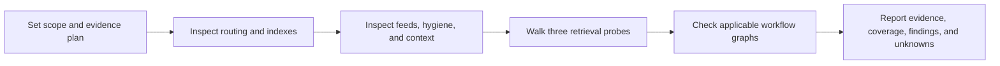

# OS Audit — is your AIOS still true?

Your operating manual, indexes, and wikis are claims about what exists and what's current. This audit checks every claim against reality. Structure problems are loud; freshness problems are silent. When people say "my agent keeps forgetting things," it's usually the agent faithfully reading a frozen index.

**Read-only.** Never fix, move, rename, or delete anything during the audit. The only write is the report file at the end. Fixes happen after the user approves them.

**Works on any Claude Code project.** Look for patterns and intent, not exact paths. The operating manual might be CLAUDE.md, AGENTS.md, or a README with a routing table. An index might be `_index.md`, `INDEX.md`, or a catalog section. A wiki might be one folder or ten. Detect by role, not by name. Never assume a specific person's folder layout.

## Today's context

- Date: use today's real date; all freshness math depends on it
- Scope: the current project root, or the subfolder passed as `$ARGUMENTS`

## The lens: four failure modes, two context types

Every finding this audit produces is a risk of one of the four ways context breaks (field vocabulary via LangChain/Drew Breunig; "bloat" names the cause):

- **Poisoning** — false information sits where the agent reads it, and the model treats everything in context as true. A stale number stated as current, an index claiming "recently active" about a month-old list, an unlabeled snapshot of data that lives live elsewhere.
- **Bloat** — too much piles in and the model loses the thread. Oversized always-loaded files, scratch inside the knowledge tree, one mega-store where segmented stores should be.
- **Confusion** — something the agent needs is missing, or something off-topic is present. Unmapped folders, data pulled but never ingested, off-domain notes in the knowledge layer.
- **Clash** — two pieces of context contradict, usually old versus new. Duplicate folders, the same fact living in two stores at two ages, rules added piecewise with no declared winner.

Anchor: poisoning is false, bloat is too much, confusion is wrong-or-missing, clash is contradictory. **Tag every finding in the report with the failure mode it feeds.** A finding that feeds none of the four is probably cosmetic; say so and rank it last.

The second lens is *when context loads*:

- **Expertise context** — stable knowledge needed on every call: the operating manual, standing rules, memory index, hot cache. Preloaded, so every word is paid for every session.
- **Situational context** — live, specific, only matters in the moment: project files, wiki pages, feeds. Fetched just in time through routing.

The audit checks that facts sit on the correct side (Check 6). A live number baked into a preloaded file WILL go stale (poisoning) while taxing every session (bloat). A standing rule buried in one project folder is invisible when it's needed (confusion).

## Evidence, scope, and prior work

Treat the audit as an evidence-backed walkthrough, not a scorecard. For every finding and every clean verdict, record:

- the path or declared external system examined;
- the reproducible method and its result (for example, `rg`, a directory listing, a parsed link, or a script's documented output);
- whether the conclusion is **verified** or **inferred**, and why;
- coverage: `inspected/total` when a total is known, or the explicit sampling rule and sample size when it is not.

Use **UNKNOWN** when the available project evidence cannot establish an answer, and **N/A** when a check does not apply. Do not convert absence of evidence into a failure. A GREEN verdict means only that the stated scope was checked and clean; it does not certify uninspected files, external services, or future changes. Do not calculate or imply an overall numeric score.

## Step 0 — Prior report and recent evidence

1. Look for earlier reports in `audits/os-audit-*.md`. If one exists, read the most recent. The final report must include a "Since last audit" section: what got fixed, what got worse, what's new.
2. Prior evidence may be reused only when it has a source report, date, scope, method, and validity rationale. Name that provenance in the new report, state what could have changed, and re-verify those parts. Otherwise mark it UNKNOWN and inspect it afresh. Do not re-sweep unchanged, well-scoped evidence merely to recreate it.

## Execution

Run the checks in order, or use bounded parallel work when it reduces elapsed time and the results can be merged without hiding gaps. Set a deadline and cancellation point for any delegated work. Fan-out is appropriate when the checks are independent and each result can be verified; it is not categorically unsafe.



The graph describes this audit's normal chain. If the project is complex, branch count is only a heuristic: judge actual decision complexity, duplicated logic, and whether the routes remain retrievable.

**If there is no operating manual and no indexes at all:** report the absence as a verified routing limitation, with the directories inspected and the retrieval impact demonstrated by probes where possible. Severity depends on whether important material could actually be retrieved through another declared route; do not assume RED solely from a missing conventional file. Continue with applicable checks.

### Retrieval walkthroughs

Perform three realistic retrieval probes through routes actually declared by the project before assigning a routing verdict. Choose questions that a user could plausibly ask, such as where to find a current standing rule, a recent artifact, or the local pointer to a live source of truth. For each, record the question, each declared route/path followed, the answer reached or missing, and the method/evidence; classify it PASS, FAIL, or UNKNOWN. These are auditor walkthroughs. Do not claim fresh-agent testing unless an isolated, newly started agent performed the probe and its setup is recorded.

### Check 1 — Routing integrity ("does everything it points to exist?")

1. Read the operating manual (CLAUDE.md, CLAUDE.local.md, AGENTS.md, or equivalent). Extract every path, folder, and file it references, including routing tables. Verify each against the repository's route contract where one is declared. The absence of an optional, machine-local, generated, or intentionally private path is not automatically a defect. A required route that is unavailable and demonstrably prevents the declared retrieval can fail; when requiredness or availability cannot be established, report UNKNOWN.
2. Reverse direction: list top-level directories and compare against the manual. A real, active directory omitted from the map is a finding only when a realistic retrieval probe cannot locate it through another declared route. Optional, generated, machine-local, and intentionally private paths are not failures simply because they are absent or omitted.
3. Misroutes count too: a rule that points at a place that exists but is NOT where the current data actually lives is worse than a dead path, because nothing errors.
4. Spot-check hardcoded paths inside `.claude/skills/*/SKILL.md` and `.claude/agents/*.md`. Skills fail silently on dead paths.
5. If a persistent memory system exists (a MEMORY.md index or memory folder): verify each index entry resolves to a file, and flag memory files missing from the index.

### Check 2 — Index truth ("do the indexes match the disk?")

1. Find every index file: `_index*.md`, `INDEX.md`, catalog sections in READMEs, hot-cache/summary files. For each, identify its declared scope and intentional exclusions before comparing entries with disk contents. Diff both directions only within that scope: rows with no expected folder (phantoms) and expected folders with no row (orphans). A curated or partial index may intentionally omit content; if its scope is ambiguous, report coverage and verdict as UNKNOWN rather than treating omitted folders as orphans.
2. Check any counts the index claims ("55 folders", "page_count: 50") against reality.
3. Check explicit freshness claims ("Recently Active", `updated:` frontmatter, or a documented cadence) against content dates and appropriate source metadata. Do not infer a cadence from a filename pattern or mtime alone. An unsubstantiated cadence is UNKNOWN, not proof that an index is lying.

### Check 3 — Freshness ("are the data feeds current?")

1. Identify each recurring data source: transcript pulls, meeting ingests, API exports, wikis, analytics dumps, or a documented fetch/refresh script. Record a separate freshness row for each feed. Compare it only with an explicitly declared cadence or reliable source metadata; otherwise use UNKNOWN for cadence and freshness.
2. Classify each feed:
   - **FRESH** — within one cycle.
   - **DRIFTING** — one cycle behind.
   - **FROZEN** — more than one documented cycle behind, and the OS still implies it is current. Estimate what is missing only when dates and cadence support the estimate.
   - **RETIRED?** — an apparently inactive feed whose lifecycle is not documented. Do not assume it is broken; ask the user whether it stopped intentionally. If retired, the fix is updating the OS so it stops implying the feed is current, not reviving it.
   - **ON-DEMAND** — feeds with no natural cadence (per-video, per-request). Not stale by definition; note the last run and move on.
3. **Check both layers: pulled vs ingested.** Data can be fresh in the raw layer (files pulled to disk) and frozen in the knowledge layer (never summarized/indexed where the agent actually looks). Report each feed's raw date AND its ingested date when the project has that split. The gap between them is un-queryable knowledge.
4. Check hot-cache / summary files (the small files loaded every session): are their key numbers and active threads dated within their claimed refresh cycle? A local artifact can establish only local snapshot freshness; it cannot prove the health, availability, or completeness of an external system.
5. **Memory staleness:** scan memory notes for time-dimensioned facts: counters ("107 left"), snapshots ("425K members"), statuses ("still open", "in progress"), and future-tense events that are now past. Flag the provably stale ones.
6. Do not collapse feeds into one misleading "knowledge ends" date. Report per-feed raw and ingested dates, their evidence, and any known retrieval dependency. State UNKNOWN where the ingestion relationship cannot be established.

### Check 4 — Bloat, duplication, and organization ("does anything live twice, or in the wrong place, or for no reason?")

1. Duplicate hunts: same content or purpose in two places (a folder in both active and archive locations; two folders whose names describe the same thing, e.g. `thing-v2` vs `Thing results v2`). Flag each pair with a recommendation for which is canonical.
2. Stale one-offs: folders containing a single old file, finished point-in-time work (past-quarter planning, old event assets), demos untouched for 60+ days. Archive candidates, not delete candidates.
3. Scratch contamination: temp files, API response dumps, `_tmp_*`, `__pycache__`, empty stub files or folders sitting inside the knowledge tree where a blind search will treat them as knowledge.
4. Always-loaded weight: word-count the files loaded every session (operating manual, memory index, hot cache). Flag growth; every extra line here taxes every future session.
5. Rule violations: if the manual states placement rules ("all X goes in one folder per Y"), find violators.
6. **Root hygiene.** Inspect loose root files by role. Valid root configuration, entrypoint, license, and documentation files are expected and are not findings. Flag a file only when its placement impairs retrieval, violates a declared contract, creates duplication, or is demonstrably stale/scratch. When recommending a home, prefer one that already exists:
   - temp/scratch output (API response dumps, one-session JSON, stray exports) → the archive or tmp folder
   - reusable assets (logos, face cutouts, brand images) → the assets/brand folder
   - media sources (recordings, renders) → their project's folder, or the archive if the project shipped
   - documents → the folder of the subject they belong to
   Only propose creating a new folder when nothing existing fits. Before recommending any move, grep for references to the file (scripts, skills, docs): a file referenced by a live code path must be flagged as move-with-caution, with the referencing paths listed.
7. **Intuitiveness gut check.** Pick 3 recent artifacts the user would plausibly ask for and walk the folder tree to them like a human in a file explorer: can each be found by clicking down obviously-named folders, no search? Flag any folder whose purpose isn't guessable from its name, and any artifact that took a wrong turn to find. If a human can't follow the trail, the agent is navigating on luck.

### Check 5 — Hygiene and silent failures ("what's broken or exposed without anyone noticing?")

1. Secrets and personal data:
   - **If the project is a git repo:** check that `.env` and any OAuth/credential files are gitignored AND untracked (`git check-ignore`, `git ls-files`). Grep tracked files for exported personal data (inbox dumps, private-call transcripts) that shouldn't be in history.
   - **If it is not a git repo:** scan directly for credential-looking files and exported personal data sitting in the knowledge tree, flag them, and note as a finding that the project has no version control (no history, no rollback, and no ignore layer for the day it becomes a repo).
2. Dead capabilities: skill folders whose file isn't exactly `SKILL.md`, missing or empty frontmatter descriptions, agents referencing models or paths that don't exist. These never load and never error.
3. Orphans: agent-memory folders with no matching agent, empty directories, 0-byte files.
4. Cadence reality check: inspect declared hooks or scheduled jobs when the project claims they exist. Manual operation is not itself a defect; do not infer it is the root cause of a freshness issue without evidence. Local configuration also cannot prove that a scheduler or external integration ran successfully.

### Check 6 — Context placement ("is everything on the right side of the expertise/situational line?")

1. Inventory the expertise layer: every file loaded into every session (operating manual, rules files, memory index, hot cache, skill descriptions). For each, scan for **situational facts baked in**: live counters, member/subscriber numbers, in-progress statuses, future-tense events, anything with a shelf life. Each one is a double finding: guaranteed future poisoning (it will go stale in a file the agent always trusts) and per-session bloat (paid for on every call). The fix is a pointer ("current numbers live in X"), not a fresher copy.
2. Reverse direction: **expertise buried in situational stores**. Standing rules, conventions, or preferences stated only inside one project folder, one old memory note, or one chat export, where no fresh session will find them. Confusion risk; the fix is promoting the rule to the manual/rules layer.
3. Precedence rule: when two stores disagree on a fact, does the manual say which one wins? If no precedence rule exists anywhere, every duplicated fact is a live clash waiting to fire. Recommend one line: "X is the source of truth for Y; everything else points at it."
4. Duplicated facts across stores: spot-check 3-5 important facts (key numbers, key statuses). Do they live in exactly one place plus pointers, or in multiple places at multiple ages? Multiple ages = clash; report the oldest copy as the poisoning risk.

### Check 7 — Graph health / wait test ("are the workflow graphs true, and are the graphs' guardrails respected?")

Applies when the project documents automations as flow graphs (Mermaid in `workflow.md`s, SOPs, or skills) — in this project that contract is `.claude/rules/graph-engineering.md`. Skip silently if the project has no such convention.

1. **Coverage & truth:** every automation/workflow doc should carry its graph. Flag missing graphs, and graphs that contradict the prose or the scripts they describe (a branch, fallback, or data source that exists in code but not in the graph, or vice versa). A stale graph is worse than none [poisoning].
2. **Wait test:** walk each graph's sequential edges asking "does this step need the RESULT of the previous one?" Flag false dependencies — steps documented (or executed) sequentially that are provably independent. Report only the ones with real payoff (long-running steps, external calls), not micro-optimizations.
3. **Loop guardrails:** retries, generate→evaluate→iterate cycles, and polling need a stopping condition appropriate to the operation. An explicit iteration cap is useful, but a deadline, cancellation signal, or state-based termination can be sufficient when it is observable and bounded.
4. **Branch guardrails:** use route count as a heuristic, not a rule. Flag a flow when its actual decision complexity, duplicate routing logic, or unclear fallback behavior makes it unreliable or hard to retrieve.
5. **Fan-out guardrails:** parallel fan-outs should converge on a node that accounts for delivered, failed, cancelled, or timed-out legs. Judge whether parallel work is appropriate from dependency, cost, and failure handling; do not impose a blanket limitation based on a leg being inexpensive.

Tag findings 1 with the standard failure modes; findings 2-5 are operational (tag `[graph]`) and get their own subsection in the report.

## Output — the report

Print in chat, then save to `audits/os-audit-YYYY-MM-DD.md` (create `audits/` if needed; this is the skill's only write).

```
# OS Audit — {date}

**Freshness scope: {per-feed evidence is reported below; do not infer a single project-wide currency date}**

| Check | Verdict | Worst finding |
|---|---|---|
| Routing integrity  | GREEN/YELLOW/RED/UNKNOWN/N/A | ... |
| Index truth        | GREEN/YELLOW/RED/UNKNOWN/N/A | ... |
| Freshness          | GREEN/YELLOW/RED/UNKNOWN/N/A | ... |
| Bloat/duplication  | GREEN/YELLOW/RED/UNKNOWN/N/A | ... |
| Hygiene            | GREEN/YELLOW/RED/UNKNOWN/N/A | ... |
| Context placement  | GREEN/YELLOW/RED/UNKNOWN/N/A | ... |
| Graph health       | GREEN/YELLOW/RED/UNKNOWN/N/A | ... |

## Scope and evidence
{For each check: inspected/total or sampling rule; paths/systems inspected; methods and results; verified or inferred conclusions; reused evidence with source report, date, scope, and validity rationale. State UNKNOWN and N/A explicitly. GREEN means clean only within this recorded scope.}

## Failure-mode exposure

| Mode | Exposure | Driven by |
|---|---|---|
| Poisoning (false)            | HIGH/MED/LOW | {the findings feeding it} |
| Bloat (too much)             | HIGH/MED/LOW | ... |
| Confusion (wrong or missing) | HIGH/MED/LOW | ... |
| Clash (contradictory)        | HIGH/MED/LOW | ... |
| UNKNOWN exposure             | UNKNOWN/none within verified scope | {checks or coverage gaps that prevent an exposure conclusion} |

## Since last audit
{only if a prior report exists: fixed / worse / new. Omit on first run.}

## What would make your agent wrong-answer you today
{2-4 bullets: the findings that cause "it says it isn't there but it is" or confidently stale answers}

## Retrieval probes
{Perform three realistic auditor walkthroughs through actual declared routing. For each record: question | declared route/path followed | answer reached or missing | evidence/method | PASS/FAIL/UNKNOWN. Examples: locate the current operating rule, find a recent artifact, and identify the source of truth for a live fact. These are auditor walkthroughs, not fresh-agent tests. Call a probe an actual fresh-agent test only if an isolated, newly started agent performed it, and record that setup.}

## Findings by check
{Concise bullets per check. Every finding names a concrete path or external system, method/result, verified/inferred status, coverage, and relevant failure-mode tag: [poisoning] [bloat] [confusion] [clash]. Include the feed table: feed | raw date | ingested date | cadence evidence | verdict | what is known missing/UNKNOWN.}

## Questions for you
{feeds classified RETIRED? — "did you stop this on purpose?" — and anything else only the owner can answer}

## Fix list (batched, await approval)
- Batch A — security + dead capabilities (do first)
- Batch B — routing + index reconciliation + re-homing misplaced files (root cleanup)
- Batch C — data catch-up (re-run frozen pipelines, refresh stale memory, retire dead feeds officially)
- Batch D — durability (hooks/crons/rituals so it can't silently freeze again)
```

Verdict rules: RED = verified evidence of a finding that would cause wrong answers today (for example, a frozen documented pipeline still represented as current, a misrouted declared route, a tracked secret, or a stale fact in an always-loaded file). YELLOW = verified or clearly labeled inferred drift that needs attention but is not shown to cause wrong answers today. GREEN = the recorded scope was checked and clean. Use UNKNOWN or N/A where evidence is insufficient or the check does not apply. Feeds the user confirms as retired do not count toward RED once the OS stops implying they are current.

Exposure rules: a mode is HIGH when a RED finding feeds it, MED when only YELLOW findings feed it, and LOW only when the relevant recorded scope is verified clean. Record UNKNOWN exposure for checks, coverage gaps, or external dependencies that prevent a conclusion. Retain partial coverage and UNKNOWN entries even when another finding supports HIGH or MED for the same mode. The exposure table is the audit's teaching moment: it tells the user not just what's broken but *how it will bite*.

## Notes

- Do not fix anything during the audit, even trivial things. Report first; the fix list is the deliverable.
- Prefer dated filenames and content dates for freshness. File mtimes are the weakest signal: bulk git operations (clone, checkout, big commits) AND cloud-sync tools (OneDrive, Dropbox, Google Drive) can touch every file at once. If many mtimes cluster on one timestamp, verify with content or git log before calling anything "active."
- A stale local snapshot of data whose live source of truth is an external tool (a task manager, a CRM) is usually a labeling problem, not proof that the external source is unhealthy. The fix may be marking it "snapshot — live data lives in X," rather than claiming a local check verifies live data.
- Suggest re-running quarterly, or after any big reorganization. The "Since last audit" section is the payoff for saving dated reports.
- If the project also has the AIS-OS kit's `/audit` skill, that's the companion: `/audit` scores whether the AIOS is built right (Four Cs, structural); `/os-audit` checks whether it's still true. Run both for the full picture. If `/audit` isn't installed, skip the reference; this skill stands alone.
